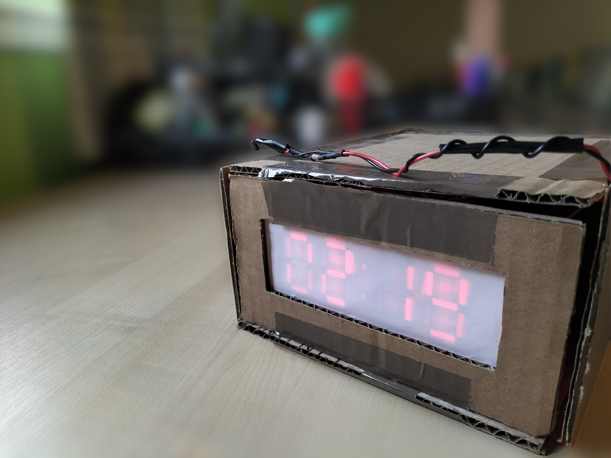
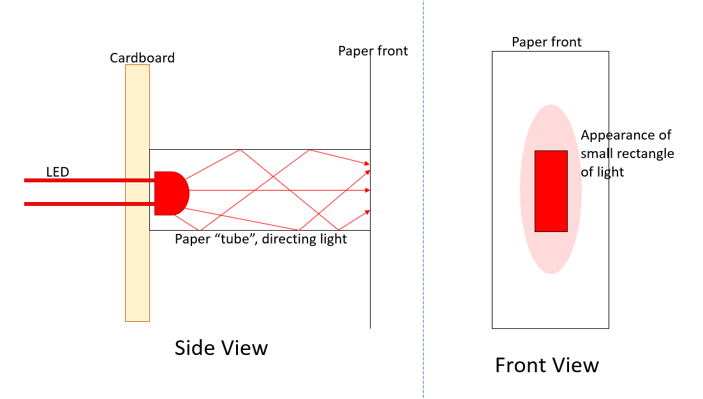
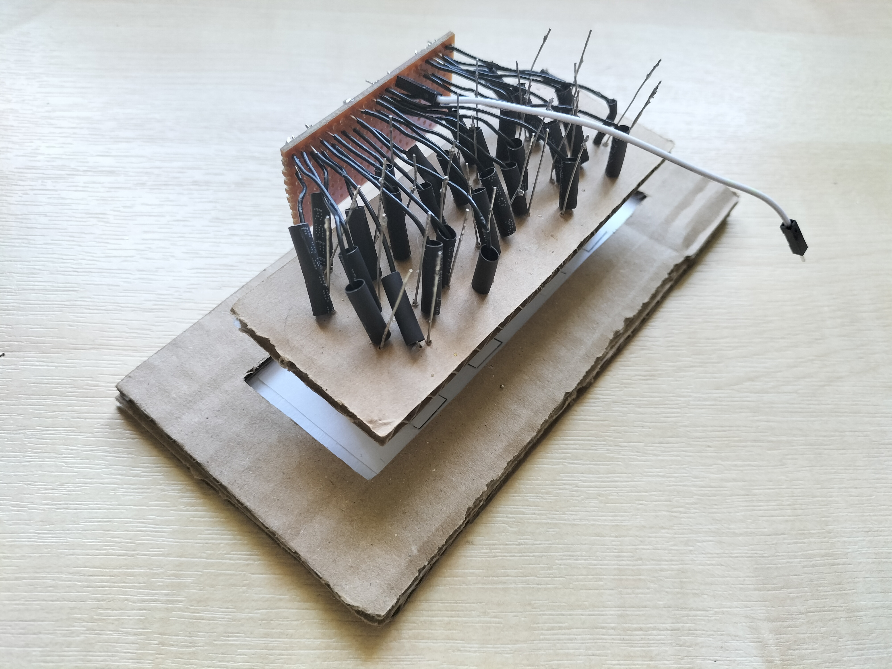
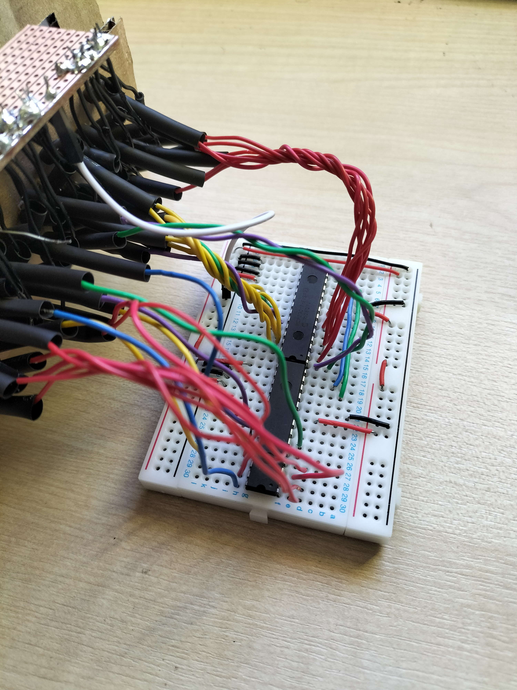
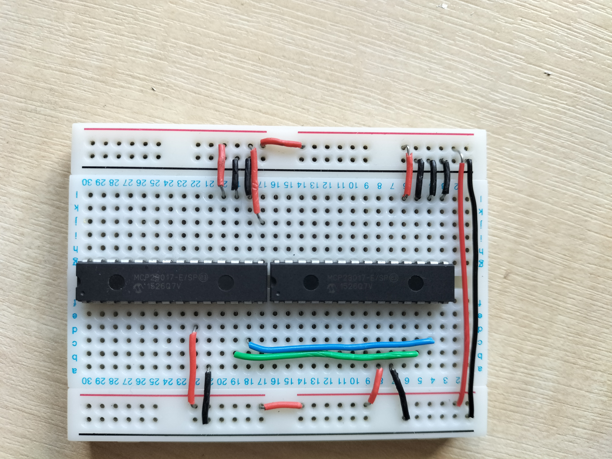

# Raspberry Pi Clock Project

I was gifted a Raspberry Pi a few years ago and I have been wanting to do something
with it since. Only recently, I was annoyed by the light from my alarm clock
shining in my face at night and having to remember to turn it on and off. It's
a small thing to get annoyed by, but I realised this would be an excellent possible
project for the Pi. I could design and build a digital clock and let the small
computer control it as I instruct.

## Requirements

I decided on four user stories to guide the requirements:

- During the day, I want to read the time at any time but keep the option to darken
any light coming from it if (for example) I took a long lie or watched a film

- During the night, I want it to be dark enough to sleep, so no light should come from it

- During the night, I may wish to temporarily see the time but go back to darkness after

- I may stay up later and, although it is night time, want the display to be illuminated

This led to the following requirements:

- An LED display will be built to show four seven-segment digits

- The Raspberry Pi (the Pi) will be configured to store 1) the current time and 2) the times
(precise to the minute) at which day and night will be separated

- The Pi will be programmed to (on startup) use the display to show the time
with the following conditions:

  - If the time falls between the day hours, the Pi will display the time unless
  a button is pressed to toggle the display

  - Else, the Pi will not display the time unless 1) a button is pressed to
  temporarily show the time or 2) a button is pressed to persistantly toggle the
  display

- Button(s) will be used to set the configuration of the Pi (current time and day/night times)

## The Display

My original plan was to use a mixture of plyboard and white translucent acrylic
to build the box and display front but I realised two issues with this plan: both
materials are more difficult to work with (which is
not a "deal-breaker" by any means but makes prototyping more difficult as small
changes require more work); and those materials have a higher cost (again, this
is not prohibitive but it unnecessarily increases the budget).

The new plan was to use cardboard as the casing and paper as the translucent
material. This worked well as both materials are low cost and easy to alter,
while still providing strength when layered.

The actual display was created by having small red LEDs with their leads poked
through a cardboard back-board. Paper was used to form small tubes to fit over
each LED and enclose the majority of its light in that space. These tubes were
glued to a front piece of paper which acts as the front of the display. The design
of the display is shown below.

### Connections

Each LED had two electrodes to connect it to the power source. This presented a
problem as having 60 of these electrodes in a small space is messy and difficult
to manage. There were two methods used to help tidy things up.

I realised that the ground connections of all the LEDs would be sent to the same
destination and so I decided to take a spare piece of stripboard and solder each
cathode to this board with the end of a jumper wire added in. This had a few
advantages. Firstly, being able to solder wires in place helps protect the project
from future issues as leads are unlikely to fall out. Second, the cathodes were
cut short and the leads bent to the side to connect to the stripboard to the side
of all the other electrics, which helped tidy things significantly.

I had to test all the wires were soldered correctly by connecting the collected
cathode to ground and touching a live wire to each anode in turn, looking for a
flash of light fron the LED it was attached to. This showed most had connected
correctly but a few needed resoldering - they must have fallen out while the join
was still plastic. At the very least, I didn't mix up any cathodes with anodes
and attach them the wrong way around!

I decided that keeping track of which lead connects to which LED would be tricky
and could be easily avoided by deciding that when it came to programming the
display, the mapping of GPIO pins to LEDs could be done regardless of what order
was used to connect them. This meant that I could brade or twist the wires together,
tidying up the scene at the expense of forgetting which wire goes where.

Not all the wires were twisted together as each wire in a twist had to be the
correct length relative to each other. This made the process more difficult as
each wire had to be cut and stripped again after twisting. In the end it was
easier to just lightly twist a bunch together with enough "wiggle-room" to let
them all fit.

## GPIO Pins

There are 30 LEDs in the display but this can be represented as 29 connections
by combining the middle dots together. As I understand it, the GPIO header on
the Pi can provide up to 26 pins for output. This is almost enough but needs some
way of extending the header. I considered a demultiplexer (which I had to hand)
but this would not work as it only allows one signal to be sent down multiple
lanes and what I need is to send multiple signals.

That is where the `MCP23017`
16-bit I/O Expander by Microchip comes in (see the
[Data Sheet](MCP23017-Data-Sheet-DS20001952.pdf)). 
One of the functions it provides is
the ability to choose which of sixteen pins has a voltage output. This meant I
was able to mount two chips on a breadboard and control them via the
`I``2``C` bus. `I``2``C` allows devices to have a 7-bit
address and connect all the devices to the controller using just one connection
of the `SDA` and `SCL` pins. The `MCP23017` is a bit more restrictive with only
the least significant 3 bits being changable - the first four being `0100`. This
was fine for my application as I only needed two and so I could connect them with
just four leads (2 for power and 2 for data).

After I connected the leads of the display to the pins of the port expanders, I
was able to begin controlling them with the Raspberry Pi.

## OS

I wanted a lightweight operating system so that it would boot quicly and focus
on just running the clock program. I eventually settled on Raspberry Pi OS Lite
as it would provide all the functionality I required.

## `I``2``C` Interface

I had thought that I would need to write a driver to control the electrical
signals sent to the port expanders but was interested to learn about the `I``2``C`
interface and how it can be used to act on devices like the `MCP23017` by treating
them just like storage devices and reading/writing individual bytes to it. In
the case of these devices, the data sheet describes the 22 registers that can be
altered to control its behaviour. There is a significant amount of functionaly
surrounding the ability of the device to accept inputs and signal interrupts on
different events and it can be a bit difficult to realise that from the initial
state on power-up, the only registers that need to be written for this project
are the `IODIRX` and `GPIOX` registers (where `X` is either `A` or `B` as the
device is split into two "ports" and each port is read/written separatly). The
former registers need to be set to all zeros as this specifies all pins as
outputs. The latter registers can then have their output set as needed with each
bit representing the state of one of the output pins (1 for high, 0 for low).

Because of how applicable this bus is for devices in general, I could just rely
on the `smbus` module in python to operate the devices by reading and writing bytes
to the correct register addresses. I could predict that the
devices would be addressed as `0x20` and `0x21` from the data sheet and the 3-bit
address hard-wired in, so I was able to verify the connection using the bash
command `i2cdetect` under `i2c-tools`.

## Scripts

The pins on the `MCP23017` devices can only be addressed with a combination of
device (`0x20` or `0x21`), port (whether to use the `A` or `B` registers), and
bit (which bit within the register refers to the pin). Additionally, there is
the issue that the settings are changed by writing whole bytes at a time, so to
change the state of a pin requires knowing the state of its neighbour pins. This
made it clear that this kind of behaviour should be abstracted over.
Because of this, I wrote the module [`led.py`](led.py).

This module was able to perform initialisation, remember the state of the pins,
and set this state using one of three methods: the device, port
and bit numbers; the simple number which is broken into device, port and bit;
and a mapped number. The mapped number method was particularly useful as it
allowed programs to be written assuming a simple numbering of the pins with the
true location of the desired pins decided later. Mappings could also be saved
and loaded later.

Once this module was written, I made two scripts that used it. [`light_script_circle.py`](light_script_circle.py)
is setup to cycle through each LED turning them all on then off in order of their
number. This was designed so that I would be able to tell how the numbers correspond
to the actual LEDs. Without a mapping, however, this just cycles seemingly at
random. That's why I wrote [`find.py`](find.py).  This script would light up just one LED
at a time, using just the device/port/bit addressing. The user can move to the
next pin by pressing the enter key and can map a number to this pin by typing
`map <n>`. Once all pins had been given a mapping, the map file could be saved
by typing `save`. This allowed me to create a map file which would assign a number
I chose to each segment and verify this map by using `light_script_circle.py`.
I will admit that this didn't work on the first try as (apart from a few inevitable
bugs) I misidentified a segment and gave it the wrong map, but I quickly found
this by looking for duplication in the map file.

## Clock Script

The initial setup of the clock script, [`clock.py`](clock.py), was quite simple as it only
had to get the time, convert this into the segments of the display, and use 
`led.py` to update the display. What made it more complicated was applying all
the additional requirements on how the clock should function and adding a button.

I decided to use a finite state machine (FSM) to control the operation of the clock
as it simplifies the process of considering unlikely cases. The FSM diagram is shown
below.

I made the choice to remove the last requirement from the list. This meant that
the configuration of the clock would now be set using a `config` file but this
would also allow the timeout duration to be specified as well. The time of the
clock would also just have to be set to the local time on the Pi. This is fine
as long as the Pi has connection to the internet or some other source of time.
This decision was made as I realised that with two additional buttons, there
would be a lot more to test and a lot more to go wrong. Additionally, this would
increase the complexity of the FSM and could be confusing for the user.

There were options to have the events - button clicks and timeouts - to happen
asynchronously, but as this would involve setting up separate threads and thread-
safe data structures, I decided that it would be simpler to have the program
check on every loop for both events occurring.

## RC.Local

With all that done, the only thing left was to add the clock script to the file
`/etc/rc.local` so that it would start when the Pi boots.

## Evaluation

### Display

Despite working quite well, there was still a significant amount of bleeding
between segments. This is caused by the fact that a single sheet of paper is not
good at keeping the light within the tubes. If I were to repeat the project, I
might look at either painting the inside surfaces black or lining them with
aluminium foil to prevent light escaping as much as possible.

It is not ideal to solder solid core wire to an electrode. I'm not actually sure
that it would be allowed anywhere in industry. This is because the surface area
of both wires is significantly reduced and there is little to no contact area.
This also made the process of joining wires to electrodes frustrating. This had
to be used as threaded wire would not connect to the breadboard and there was no
perfboard to hand.

Overall I think it may have been better to fix all the LEDs to a perfboard -
a circuit board with the connections already printed would be the best but this
was just a prototype project and that would have cost too much - which would have
allowed me to use better soldering techniques to connect the components together.
I didn't choose this option as I did not already have any perfboard to hand and
was able to do the project the way I did by mostly using materials I already had,
but this could be explored if the project is repeated.

### GPIO Pin Expanders

I'm glad I used this method as it worked exactly as I had wished. Like the display,
it would have been better to have it soldered into a board, but I used this method
for the same reasons as the display.

I'm also glad I was able to avoid connecting directly to the GPIO pins on the Pi
as soldering to them is more difficult and I find having too many leads can fall
out too easily. Having just four connections is much more reliable.

### OS

The OS used takes about 20 seconds to boot each time which is not ideal. In future,
it may be a good idea to disable as much of the OS as possible to speed this up.

### Configuration

I removed the last requiremnt which was that the configuration (the time of day
and the times that separate day and night) should be changable while the device
is active by using one or more buttons as an interface. I made this decision for
the reasons stated above. I think it would have been good to give the device this
additional functionality as the user would not need to edit the configuration
file - either by turning off the Pi and changing the file on the SD card where it
is stored or by editing it in the terminal on the Pi - but it would also have 
made the device more complicated to use as I would have to remember the order of
button presses required and interpret the indications of the display. It was 
because of this that I decided to remove this requirement.

One possible area for future expansion would be to allow remote configuration.
It would not be difficult to setup the Pi to accept SSH connections which would
allow the configuration file to be externally changed. Going even further, the
Pi could be setup as a web server allowing API calls to change the internal state.
That option might be worse for security, however. These methods would also allow
a potentially more complicated configuration, letting it act differently for
weekends and having a "holiday-mode" to replace normal operation for a limited
time. As I said, this could be an area for future expansion but the setup of the
device for now is satisfactory.

## Conclusion

The aim of this project was not to reinvent the nature of bedside clocks. The
aim was to design and implement my own clock from basic materials, to gain
experience working with electronics and develop my soft skills such as problem
solving in a discipline that was relatively new to me. In that measure, this
project has been an absolute success. Although there are many areas that can be
improved if it is ever repeated, the finished product meets almost all of the
requirements that I originally specified and without this project I would not
have the experience to reason about what could be improved.

I would definitely recommend that anyone looking at or thinking about doing
something like this for the first time try something like this as the learning
opportunity is invaluable and it was enjoyable to work through.
